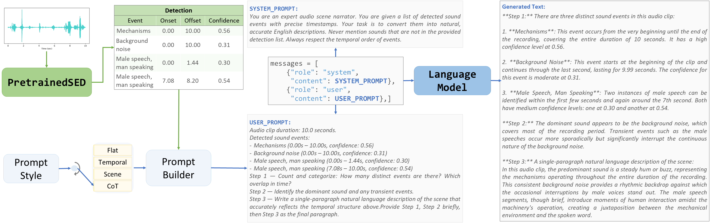
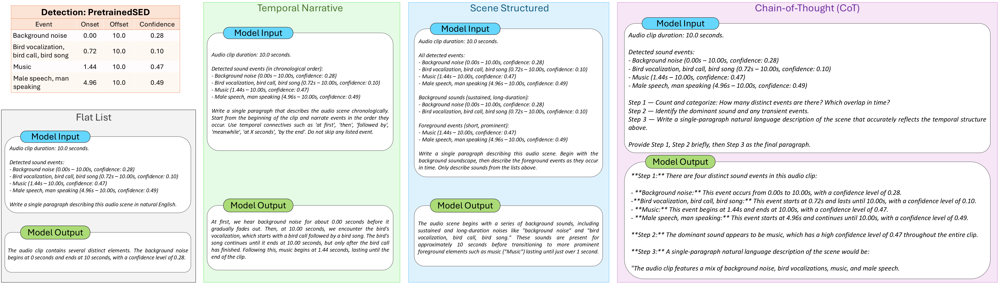

# SED2Text
# 🚧 Under Construction 🚧

- The updates to this repository are yet to be finished.
- The `Under Construction` tag will be removed once updates are completed.

# Setup
### Clone the repository
```
git clone https://github.com/Snehitc/SED2Text.git
cd SED2Text
```

### Create Environment
```
conda create -n SED2Text python=3.12
conda activate SED2Text
```

### Install requirements
```
pip install -r requirements.txt
```

### Install torch (CUDA version)
```
pip install torch==2.5.1 torchaudio==2.5.1 --index-url https://download.pytorch.org/whl/cu121
```


# Usage
### Inference
```
python inference.py
```

### Score Prediction
```
python score/score.py
```

### Inference (one example)
```
python inference_example.py
```
> example output
* ```
  Loading pretrained checkpoint:  BEATs_strong_1
  [PretrainedSED] Loaded 'BEATs' → device=cuda
  Warning: You are sending unauthenticated requests to the HF Hub. Please set a HF_TOKEN to enable higher rate limits and faster downloads.
  Loading weights: 100%|██████████████████████████████████████████| 290/290 [00:02<00:00, 105.67it/s]
  
  SED Prediction: 
                 event_label  onset  offset     filename  confidence
  0         Background noise   4.20   10.00  WsaOJT2SsPg        0.26
  5               Mechanisms   4.24    7.80  WsaOJT2SsPg        0.16
  7  Telephone dialing, DTMF   5.48    7.48  WsaOJT2SsPg        0.13
  1              Busy signal   5.60    5.88  WsaOJT2SsPg        0.10
  2              Busy signal   6.00    6.64  WsaOJT2SsPg        0.10
  3              Busy signal   6.84    7.04  WsaOJT2SsPg        0.10
  6                    Music   7.24   10.00  WsaOJT2SsPg        0.65
  4             Male singing   7.48   10.00  WsaOJT2SsPg        0.47
  
  Generated Text (flat): ['The audio clip begins with background noise, which gradually becomes more
                          prominent as it builds up over time. The next event is a telephone dialing,
                          followed by a busy signal and another busy signal before the music starts playing.']
  
  Score Predicton:
  Loading narrations & detections: 100%|████████████████████████████| 1/1 [00:00<00:00, 295.44file/s]
  Extracting event mentions: 100%|██████████████████████████████████| 1/1 [00:00<00:00,  5.46file/s]
  Loading weights: 100%|████████████████████████████████████████████| 103/103 [00:00<00:00, 1226.96it/s]
  Encoding 15 mentions and 6 labels on GPU...
  Batches: 100%|████████████████████████████████████████████████████| 1/1 [00:00<00:00, 19.59it/s]
  Batches: 100%|████████████████████████████████████████████████████| 1/1 [00:00<00:00, 70.75it/s]
  Computing Scores: 100%|███████████████████████████████████████████| 1/1 [00:00<00:00, 60.33file/s]
  +-------+-------+-------------+----------+-------+---------+---------+-------------+
  |   TOA |    HD |   Precision |   Recall |    F1 |   avg M |   avg L |   M/L ratio |
  +=======+=======+=============+==========+=======+=========+=========+=============+
  | 1.000 | 0.359 |       0.267 |    0.667 | 0.381 |      15 |       6 |       2.500 |
  +-------+-------+-------------+----------+-------+---------+---------+-------------+
  ```

# Pipeline 
> 1. PretrainedSED: BEATs-based,
> 2. LM: Qwen2.5-1.5B-Instruct



# Example: All prompt types
> Prompt type - Flat List, Temporal Narrative, Scene Structured, Chain-of-Thought (CoT)\
> LM: Qwen2.5-0.5B-Instruct



# Results
Table: Results across five LMs and four prompt formats ($$avg. \mathcal{L} = 4.247$$; blue = best per row)
<table>
  <thead>
    <tr>
      <th><p align="center">Metric</p></th>
      <th><p align="center">Prompt Format</p></th>
      <th><p align="center">SmolLM2-135M</p></th>
      <th><p align="center">SmolLM2-360M</p></th>
      <th><p align="center">Qwen2.5-0.5B</p></th>
      <th><p align="center">Qwen2.5-1.5B</p></th>
      <th><p align="center">SmolLM2-1.7B</p></th>
    </tr>
  </thead>
  <tbody>
    <!-- Temporal ordering  Accuracy  (ToA) ↑ -->
    <tr>
      <td rowspan="4"><p align="center">Temporal <br> ordering <br> Accuracy <br> (ToA) ↑ </p></td>
      <td><p align="center">Flat</p></td>
      <td><p align="center">0.854</p></td>
      <td><p align="center">0.816</p></td>
      <td><p align="center">$${\color{blue}0.894}$$</p></td>
      <td><p align="center">0.767</p></td>
      <td><p align="center">0.786</p></td>
    </tr>
    <tr>
      <td><p align="center">Temporal</p></td>
      <td><p align="center">0.829</p></td>
      <td><p align="center">0.792</p></td>
      <td><p align="center">$${\color{blue}0.907}$$</p></td>
      <td><p align="center">0.749</p></td>
      <td><p align="center">0.850</p></td>
    </tr>
    <tr>
      <td><p align="center">Scene</p></td>
      <td><p align="center">0.776</p></td>
      <td><p align="center">0.657</p></td>
      <td><p align="center">$${\color{blue}0.791}$$</p></td>
      <td><p align="center">0.763</p></td>
      <td><p align="center">0.759</p></td>
    </tr>
    <tr>
      <td><p align="center">CoT</p></td>
      <td><p align="center">0.816</p></td>
      <td><p align="center">0.857</p></td>
      <td><p align="center">0.762</p></td>
      <td><p align="center">0.683</p></td>
      <td><p align="center">$${\color{blue}0.881}$$</p></td>
    </tr>
    <!-- Hallucination Density (HD) ↓ -->
    <tr>
      <td rowspan="4"><p align="center">Hallucination <br> Density <br> (HD) ↓ </p></td>
      <td><p align="center">Flat</p></td>
      <td><p align="center">0.556</p></td>
      <td><p align="center">$${\color{blue}0.509}$$</p></td>
      <td><p align="center">0.567</p></td>
      <td><p align="center">0.554</p></td>
      <td><p align="center">0.534</p></td>
    </tr>
    <tr>
      <td><p align="center">Temporal</p></td>
      <td><p align="center">0.546</p></td>
      <td><p align="center">0.473</p></td>
      <td><p align="center">$${\color{blue}0.420}$$</p></td>
      <td><p align="center">0.553</p></td>
      <td><p align="center">0.467</p></td>
    </tr>
    <tr>
      <td><p align="center">Scene</p></td>
      <td><p align="center">0.595</p></td>
      <td><p align="center">0.527</p></td>
      <td><p align="center">$${\color{blue}0.473}$$</p></td>
      <td><p align="center">0.537</p></td>
      <td><p align="center">0.505</p></td>
    </tr>
    <tr>
      <td><p align="center">CoT</p></td>
      <td><p align="center">0.514</p></td>
      <td><p align="center">0.414</p></td>
      <td><p align="center">$${\color{blue}0.396}$$</p></td>
      <td><p align="center">0.479</p></td>
      <td><p align="center">0.432</p></td>
    </tr>
    <!-- Precision ↑ -->
    <tr>
      <td rowspan="4"><p align="center">Precision ↑</p></td>
      <td><p align="center">Flat</p></td>
      <td><p align="center">0.164</p></td>
      <td><p align="center">$${\color{blue}0.217}$$</p></td>
      <td><p align="center">0.187</p></td>
      <td><p align="center">0.139</p></td>
      <td><p align="center">0.190</p></td>
    </tr>
    <tr>
      <td><p align="center">Temporal</p></td>
      <td><p align="center">0.104</p></td>
      <td><p align="center">0.128</p></td>
      <td><p align="center">$${\color{blue}0.174}$$</p></td>
      <td><p align="center">0.106</p></td>
      <td><p align="center">0.163</p></td>
    </tr>
    <tr>
      <td><p align="center">Scene</p></td>
      <td><p align="center">0.094</p></td>
      <td><p align="center">0.127</p></td>
      <td><p align="center">$${\color{blue}0.188}$$</p></td>
      <td><p align="center">0.112</p></td>
      <td><p align="center">0.138</p></td>
    </tr>
    <tr>
      <td><p align="center">CoT</p></td>
      <td><p align="center">0.101</p></td>
      <td><p align="center">0.088</p></td>
      <td><p align="center">$${\color{blue}0.102}$$</p></td>
      <td><p align="center">0.061</p></td>
      <td><p align="center">0.092</p></td>
    </tr>
    <tr>
      <!-- Recall ↑ -->
      <td rowspan="4"><p align="center">Recall ↑</p></td>
      <td><p align="center">Flat</p></td>
      <td><p align="center">0.548</p></td>
      <td><p align="center">$${\color{blue}0.675}$$</p></td>
      <td><p align="center">0.541</p></td>
      <td><p align="center">0.447</p></td>
      <td><p align="center">0.535</p></td>
    </tr>
    <tr>
      <td><p align="center">Temporal</p></td>
      <td><p align="center">0.686</p></td>
      <td><p align="center">0.792</p></td>
      <td><p align="center">0.814</p></td>
      <td><p align="center">0.713</p></td>
      <td><p align="center">$${\color{blue}0.879}$$</p></td>
    </tr>
    <tr>
      <td><p align="center">Scene</p></td>
      <td><p align="center">0.663</p></td>
      <td><p align="center">0.792</p></td>
      <td><p align="center">$${\color{blue}0.833}$$</p></td>
      <td><p align="center">0.726</p></td>
      <td><p align="center">0.827</p></td>
    </tr>
    <tr>
      <td><p align="center">CoT</p></td>
      <td><p align="center">0.852</p></td>
      <td><p align="center">0.815</p></td>
      <td><p align="center">0.889</p></td>
      <td><p align="center">0.918</p></td>
      <td><p align="center">$${\color{blue}0.984}$$</p></td>
    </tr>
    <!-- F1 ↑ -->
    <tr>
      <td rowspan="4"><p align="center">F1 ↑</p></td>
      <td><p align="center">Flat</p></td>
      <td><p align="center">0.240</p></td>
      <td><p align="center">$${\color{blue}0.314}$$</p></td>
      <td><p align="center">0.265</p></td>
      <td><p align="center">0.199</p></td>
      <td><p align="center">0.266</p></td>
    </tr>
    <tr>
      <td><p align="center">Temporal</p></td>
      <td><p align="center">0.177</p></td>
      <td><p align="center">0.214</p></td>
      <td><p align="center">$${\color{blue}0.274}$$</p></td>
      <td><p align="center">0.180</p></td>
      <td><p align="center">0.268</p></td>
    </tr>
    <tr>
      <td><p align="center">Scene</p></td>
      <td><p align="center">0.160</p></td>
      <td><p align="center">0.214</p></td>
      <td><p align="center">$${\color{blue}0.295}$$</p></td>
      <td><p align="center">0.189</p></td>
      <td><p align="center">0.230</p></td>
    </tr>
    <tr>
      <td><p align="center">CoT</p></td>
      <td><p align="center">0.174</p></td>
      <td><p align="center">0.156</p></td>
      <td><p align="center">$${\color{blue}0.178}$$</p></td>
      <td><p align="center">0.113</p></td>
      <td><p align="center">0.166</p></td>
    </tr>
    <tr>
      <td colspan="7"></td>
    </tr>
    <!-- avg. M -->
    <tr>
      <td rowspan="4"><p align="center">avg. $$\mathcal{M}$$</p></td>
      <td><p align="center">Flat</p></td>
      <td><p align="center">12.359</p></td>
      <td><p align="center">12.116</p></td>
      <td><p align="center">11.016</p></td>
      <td><p align="center">11.896</p></td>
      <td><p align="center">10.663</p></td>
    </tr>
    <tr>
      <td><p align="center">Temporal</p></td>
      <td><p align="center">26.062</p></td>
      <td><p align="center">25.586</p></td>
      <td><p align="center">20.130</p></td>
      <td><p align="center">26.683</p></td>
      <td><p align="center">22.068</p></td>
    </tr>
    <tr>
      <td><p align="center">Scene</p></td>
      <td><p align="center">27.491</p></td>
      <td><p align="center">25.694</p></td>
      <td><p align="center">19.179</p></td>
      <td><p align="center">26.121</p></td>
      <td><p align="center">24.293</p></td>
    </tr>
    <tr>
      <td><p align="center">CoT</p></td>
      <td><p align="center">39.715</p></td>
      <td><p align="center">37.485</p></td>
      <td><p align="center">38.352</p></td>
      <td><p align="center">62.235</p></td>
      <td><p align="center">45.201</p></td>
    </tr>
    <!-- M/L ratio -->
    <tr>
      <td rowspan="4"><p align="center">$$\mathcal{M}/\mathcal{L}$$ ratio</p></td>
      <td><p align="center">Flat</p></td>
      <td><p align="center">3.810</p></td>
      <td><p align="center">3.722</p></td>
      <td><p align="center">3.303</p></td>
      <td><p align="center">3.764</p></td>
      <td><p align="center">3.230</p></td>
    </tr>
    <tr>
      <td><p align="center">Temporal</p></td>
      <td><p align="center">8.046</p></td>
      <td><p align="center">7.929</p></td>
      <td><p align="center">6.390</p></td>
      <td><p align="center">8.269</p></td>
      <td><p align="center">6.740</p></td>
    </tr>
    <tr>
      <td><p align="center">Scene</p></td>
      <td><p align="center">8.553</p></td>
      <td><p align="center">7.909</p></td>
      <td><p align="center">5.749</p></td>
      <td><p align="center">7.931</p></td>
      <td><p align="center">3.230</p></td>
    </tr>
    <tr>
      <td><p align="center">CoT</p></td>
      <td><p align="center">12.416</p></td>
      <td><p align="center">11.161</p></td>
      <td><p align="center">12.007</p></td>
      <td><p align="center">17.743</p></td>
      <td><p align="center">13.165</p></td>
    </tr>
  </tbody>

</table>


# Directory Structure
```
SED2Text
  |___docs
        |___Pipeline_scaled.png
        |___prompts_scaled.png
  |___LICENSE
  |___README.md
```

# Citation
This work has been submitted to the DCASE Workshop 2026 and is under review at present.\
Preprint is available with the following citation in "ResearchGate"
> $$\color{blue}Request$$_: I wanted to submit a preprint to arXiv, but I didn't get anyone to endorse my paper. Based on my work (this or any previous one), I would appreciate endorsements for an arXiv (future) submission._
```
@unknown{SED2Text,
author = {Chunarkar, Snehit and Lee, Chi-Chun},
year = {2026},
month = {07},
pages = {},
title = {Structured Event-to-Text Generation for Zero-Shot Audio Description: A Prompt Study Across LLM Sizes},
doi = {10.13140/RG.2.2.34477.45282},
url = {https://doi.org/10.13140/RG.2.2.34477.45282}
}
```

# ToDo
- [ ] Code
  - [ ] Inference
  - [ ] Inference One Example
  - [ ] Result replication
  - [ ] Score
- [ ] README
  - [x] Pipeline
  - [x] Example
  - [x] Results
  - [ ] Setup
  - [ ] Directory Structure
  - [ ] Citation
- [ ] Requirements

